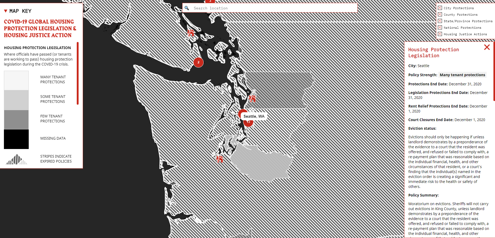

# Digital Geographies Final Essay

## Essay Introduction:
  The current Coronavirus pandemic was certainly one of the more devasting societal happenings that has occurred in recent memory. The global response to the pandemic has resulted in all people of all nations having to face a tremendous amount of adversity over the past year. Specifically, many Americans have had to deal with the financial, economic, and societal impacts that the pandemic has brought upon them. In response to the current events that we are experiencing, I decided to write this final essay with a focus on the impact COVID-19 has had on housing evictions on a global scale as part of my analysis of a digital geographies-related project. This essay will analyze a COVID-19 Anti-Eviction Map that was produced by the Anti-Eviction Mapping Project that you can access following this link: https://covid19.antievictionmap.com/ 
  
## Map Introduction:
  The goal of the COVID-19 Anti-Eviction Map that was created by the Anti-Eviction Mapping Project group was to visualize the current/recent COVID-19-related housing actions that were undertaken on a global scale through a web map. This web map is used to highlight the different housing legislation, housing justice actions, housing protections, and housing eviction responses in response to the COVID-19 pandemic. Regarding map functionality, this web map categorizes Tenant Protections based on the following 4 categories of eviction risk: Many Tenant Protections, Some Tenant Protections, Few Tenant Protections, and Missing Data. Furthermore, the web map also indicates geographic areas where eviction protections and other related policies have expired. The final product is of a thematic web map that also employs the use of proportional symbols (in this case, circles) to better support the narrative given by this map. 
  
  One of the major functions that this choropleth web map design employs is the use of interactivity. For example, users have the option to select different map layers by filtering through 5 different categories of Housing Protection variables: City Protections, County Protections, State/Province Protections, National Protections, and Housing Justice Actions. Furthermore, other interactive options include the ability to zoom in/outwards starting at a global scale, and up to a county-level scale. The pop-up features that are also included in this web map offer a more personalized experience of the map users, such as the following excerpt:
<blockquote>

“The personalized anecdotes written by the people can help map readers better understand the societal motives behind people supporting rent strikes in different parts of the world.”

</blockquote>
  Another map element that makes this web map unique is the inclusion of a responsive search bar that allows users to focus in on areas of interest. For me, this is a first in seeing this type of interactivity and user interface on a web map, as previous maps that I had examined relied solely on the user knowing the general geographic location where he/she wanted to focus on. Due to its interactive elements, this web map allowed me to gain a more in-depth understanding of the housing effects of COVID-19 on areas that I find personal attachment to, such as in Mill Creek, WA where I am currently living.

  Because this is a publicly available map, I believe that the intended audience is any and every person who has interest in learning about the impact that COVID-19 has had on tenant protections. While the data collection date is not specified, I can assume that the data used in creating this web map was collected throughout the 2020 year when the COVID-19 pandemic first began. This web map was produced through an open collaboration and open-data crowdsourcing method that relied on the work of volunteers and survey responders to produce as accurate of a map as possible. However, because the data used cannot be considered official, the accuracy of this map is relied upon the accuracy of the respondents who have submitted their data to the Anti-Eviction Mapping Project.

## Systematic Architecture:
  Using the “Inspect” feature available as part of the Google Chrome developer tools, I noticed that there were some similarities between the architecture used to create this Anti-Eviction Map and the different technologies and tools that we learned throughout this quarter in GEOG 458. Inspecting the elements page of this web map revealed that this web map was written using HTML, CSS, and JavaScript, which are 3 different programming tools that we also interacted with throughout this quarter to produce our own web maps. More specifically, this web map was made by incorporating Leaflet, which I learned is a popular JavaScript library that is often used to create web maps. Other relevant technological packages used include Carto for base maps, and Google API fonts for more of an aesthetic appearance. More advanced scripts were also included in developing this web map that are outside the scope of this course. 
	
  Under the Sources tab, I noticed that the file organization and architecture of this web map included the image of a cloud, which I can assume meant that this web map was used with the help of Cloud technologies. If this is the correct assumption, then it would make sense that cloud technologies were utilized in this project because this was a web map that was created in a highly collaborative environment from teams across the United States and even included the work of teams on a global scale. The advancements of cloud technologies have made it easier and more cost-effective to host applications such as web maps in an online, virtual environment where file sharing can be done much more efficiently and effectively. 

## Web Mapping Design and UI/UX Elements:
  Overall, I do feel that the UI/UX elements present in this web map are user friendly: All the functionalities work as they are intended to do so, the layout of the web map elements is standard for a  cartographic map, and the none of the proportional circles used are distracting in their presentation. The use of the pop-up boxes when clicking elements also eliminates the need to constantly match up the web map elements to the Map Key, which made me not lose interest in having to always go back and forth between the two. However, one element that I questioned was the use of the special font that was included in the write up for the descriptions in the web map. The fonts used in this web map are not uniform throughout all sections of the map, and therefore can be sometimes distracting having to deal with the changes in font types while you are exploring this visualization. 

## Discussion of the Web Map:
  After examining this map, one suggestion that I would have to the map creators would be to also include the data collection methodology that went into producing this web map. Because this is an open-source project that relied heavily on the inputs from users throughout the world, I believe that asking about the accuracy of the data portrayed is a legitimized question. To reduce such skepticism from future readers, I believe that it would be beneficial to include or be more transparent about the survey methodologies that were used to collect the data. For example, the Anti-Eviction Mapping Project could include a hyperlink to a methodologies page that detailed out how interviews or surveys were conducted, say either online, over the phone, or in person. Earlier in this quarter, I examined an article that had stated that many dashboards that are produced today may not actually give an accurate portrayal of the story the dashboard is trying to convey due to misuse or misinterpretation of the data itself. While I am not saying that this is the case in this web map, I do believe that it highlights the need to be as transparent as possible to readers about the accuracy of the methodologies that went into producing this map, especially as it relates to data.
  
  In relation to relevant readings and course material that we covered in GEOG 458, the Anti-Eviction Map can be used as an example of how cartography can bring about social awareness and change in a geographic sense. In my own personal instance, I was not aware that the state responses regarding tenant protections varied so drastically. For example, there are a state such as New York includes many tenant protections for its residents, while a state such as Wyoming can be categorized as having very few tenant protections for its residents. While both states are of course part of the United States, this map highlights that differing and sometimes divisive government responses each state has had because of the COVID-19 pandemic. The inclusion of the pop-up text boxes that include personal anecdotes helps this web map tell the stories of different Americans that have been affected by the pandemic throughout the past year. Over the course of this quarter, I have learned and even created different geo-visualizations that have been used to support or create a story or narrative of interest. For example, we have gained experience in learning about create Geo Narratives that include text, different map layers, and interactivity to show geographic changes in a before-and-after sequence. Therefore, maps such as the COVID-19 Anti-Eviction Map can serve as powerful facilitators of bringing about a more personalized and authentic narrative that may be lost in just numerical data itself. 
